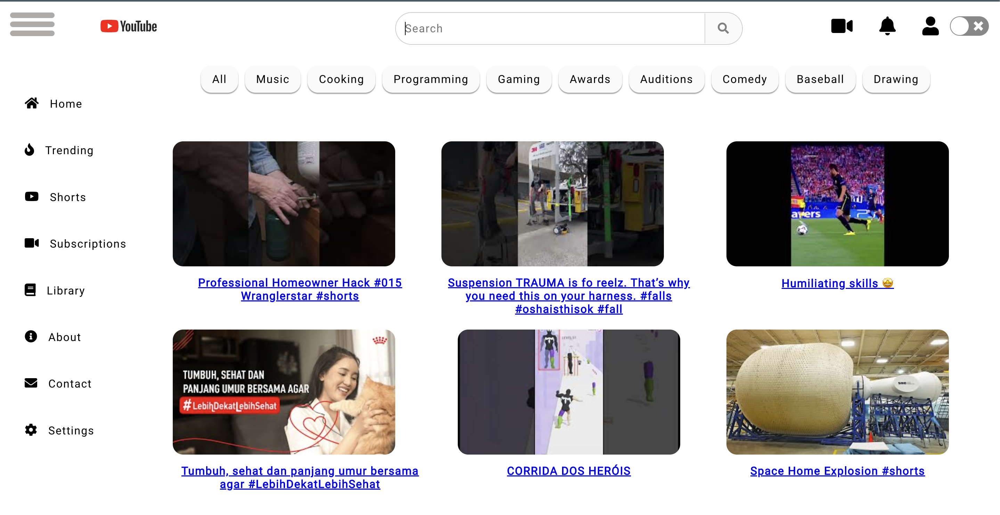
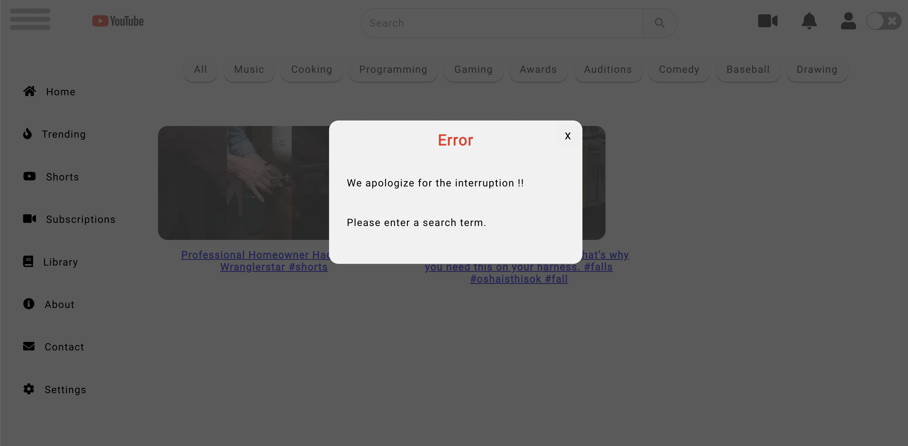
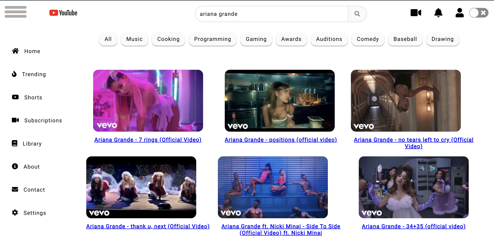
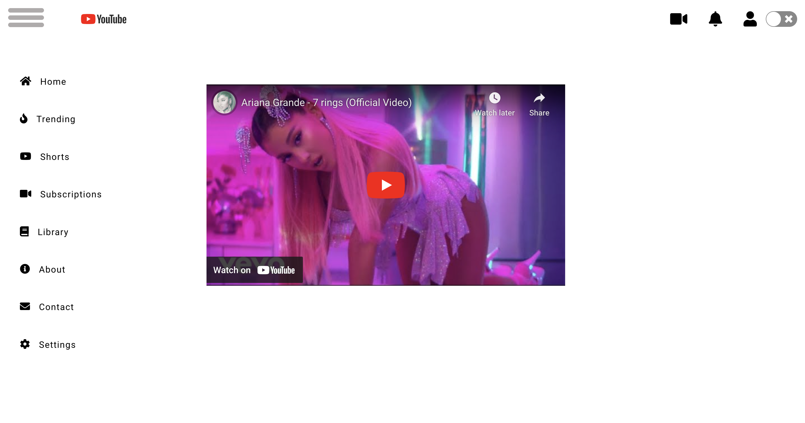
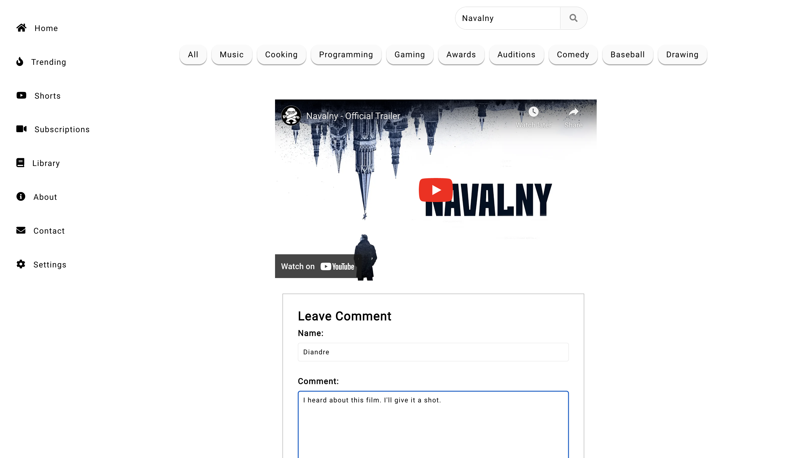
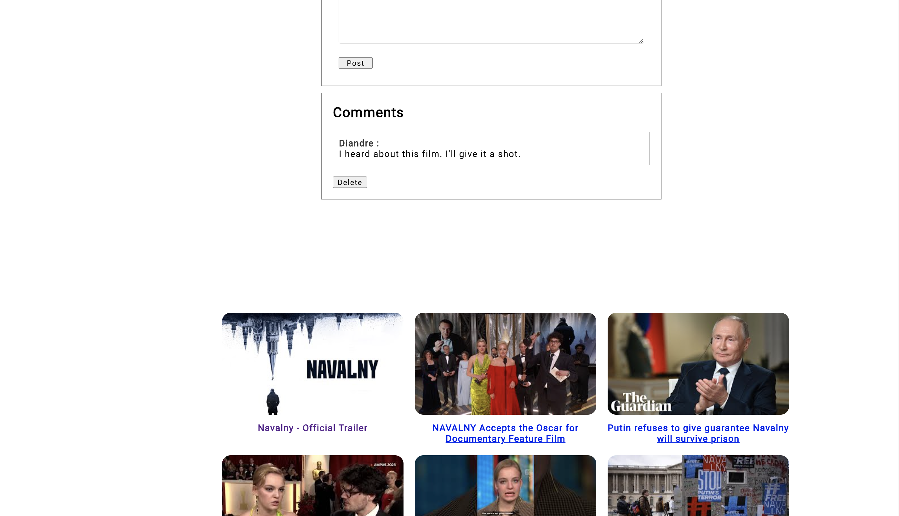
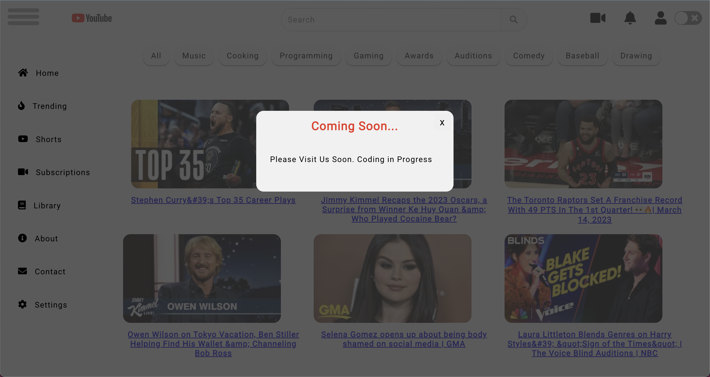

# Three M's Tube
[Three M's Tube Project](https://three-m-youtube.netlify.app) is a web development project that aims to create a replica of the YouTube website, providing users with a similar experience to the original site. Our team of three developers worked towards creating a fully functional clone of YouTube's features. The project's primary goal was to offer users a seamless experience and a chance to enjoy the features and functionalities of YouTube in a familiar environment.

Our team of developers utilized various technologies including React, JavaScript, HTML, and CSS to create a fully functional clone, including features such as search a video, watch the video, and additional features such as a hamburger menu, contact us, and about us pages. Additionally, we integrated the YouTube Data API, Email Js API and utilized Firebase for writing, saving, updating, and deleting comments. The platform also includes additional features such as a hamburger menu, contact us, and about us pages to enhance the user experience. 

With its user-friendly interface and advanced search options, the Three M's Tube Project offers a seamless experience for users looking to enjoy the functionality of YouTube. The project was completed within a duration of 7 days.

### Team Members
Our team consisted of three members, each with a specific role:

- Diandre Miller
- Ariunaa Myagmar
- Vandhana Mohan

To learn more about our team members, please refer to the GitHub and LinkedIn links provided in the table below.

| Dev Team | Role | GitHub | LinkedIn
| :--------------: | :-------: | :-------: | :-------: |
| **Diandre Miller**  | Team Lead    | [GitHub](https://github.com/DiandreMiller)  | [LinkedIn](https://www.linkedin.com/in/diandre-miller/)
| **Ariunaa Myagmar** | BackEnd Lead | [GitHub](https://github.com/ariunaamy)      | [LinkedIn](https://www.linkedin.com/in/ariunaa-myagmar/)
| **Vandhana Mohan**  | Testing Lead | [GitHub](https://github.com/Vandhana-Mohan) | [LinkedIn](https://www.linkedin.com/in/vandhanamohan/)

---

### [Trello Link](https://trello.com/b/Yb57y7Fa/react-youtube)

### [Miro Link](https://miro.com/app/board/uXjVMfRHl7c=/)

---

## Installation

To install this repository, please use npm:

```
  npm install 
```

---

## Skills

Skills:

- React: A JavaScript library used for building user interfaces and web applications.
- HTML: Used to create the structure and layout of web pages.
- CSS: Used to style and format web pages.
- JavaScript: A programming language that allows you to add interactivity and dynamic behavior to web pages.
- Git: A version control system that allows you to track changes to your code and collaborate with others.
- GitHub: GitHub is a popular platform used for hosting and sharing code repositories.
- Firebase: A platform that provides various tools and services for building web applications, including real-time database and hosting.
- Adobe Photoshop, PicsArt: A graphics editing software used for image editing and manipulation.
- YouTube Data API integration: Incorporating data from remote sources using APIs (Application Programming Interface)
- EmailJS API: Used to send emails directly from JavaScript code, without the need for a server-side implementation.


#### [Click Here](https://three-m-youtube.netlify.app) - Visit our website to explore the different pages and features we have developed. Below are some screenshots to give you an idea of what to expect.

---
#### Home Page.




---

#### Do leave me a feedback so I can improve. 




---

#### Read our other reviews.




---

#### Read our other reviews.




---

#### Leave a comment / Firebase.


---

#### See comments / Firestore.



#### Contact Us 




---

#### About Us 


---

### Resources

Hamburger Menu - [WebDev Basics - React Animated Navbar Burger Menu [2022]]()